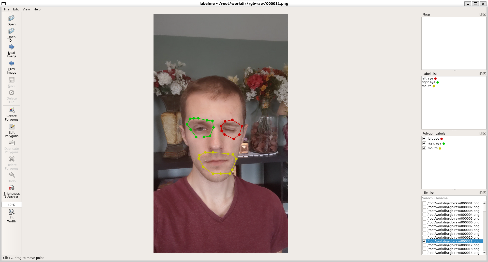

# CoNeRF: Controllable Neural Radiance Fields 
[](https://arxiv.org/abs/2112.01983)
[](https://github.com/kacperkan/conerf/blob/main/LICENSE)
[](https://conerf.github.io/)
[](http://cvlab.ii.pw.edu.pl:9000/conerf-dataset/datasets.zip)

This is the official implementation for "CoNeRF: Controllable Neural Radiance Fields" 

* [Project Page](https://conerf.github.io)
* [Paper](https://arxiv.org/abs/2112.01983)
* [Video](https://conerf.github.io/showcase.mp4)

The codebase is based on [HyperNeRF](https://github.com/google/hypernerf)
implemented in [JAX](https://github.com/google/jax), building on
[JaxNeRF](https://github.com/google-research/google-research/tree/master/jaxnerf).


## Setup
The code can be run under any environment with Python 3.8 and above.
(It may run with lower versions, but we have not tested it).

We recommend using [Miniconda](https://docs.conda.io/en/latest/miniconda.html) and setting up an environment:

    conda create --name conerf python=3.8

Next, install the required packages:

    pip install -r requirements.txt

Install the appropriate JAX distribution for your environment by  [following the instructions here](https://github.com/google/jax#installation). For example:

    # For CUDA version 11.1
    pip install --upgrade "jax[cuda111]" -f https://storage.googleapis.com/jax-releases/jax_releases.html


## Dataset
### Basic structure
The dataset uses the [same format as Nerfies](https://github.com/google/nerfies#datasets) for the image extraction and camera estimation.

For annotations, we create an additional file `annotations.yml` consisting of attribute values and their corresponding frames, and a folder with `[frame_id].json` files (only annotated frames are required to have a corresponding `.json` file) where each `*.json` file is a segmentation mask created with [LabelMe](https://github.com/wkentaro/labelme). In summary, each dataset has to have the following structure:
```
<dataset>
    ├── annotations
    │   └── ${item_id}.json
    ├── annotations.yml
    ├── camera
    │   └── ${item_id}.json
    ├── camera-paths
    ├── colmap
    ├── rgb
    │   ├── ${scale}x
    │   └── └── ${item_id}.png
    ├── metadata.json
    ├── dataset.json
    ├── scene.json
    └── mapping.yml
```

The `mapping.yml` file can be created manually and serves to map class indices to class names which were created with LabelMe. It has the following format:
```yaml
<index-from-0>: <class-name>
```
for example:
```yaml
0: left eye
1: right eye
```

The `annotations.yml` can be created manually as well (though we encourage using the provided notebook for this task) and has the following format:
```yaml
- class: <id>
  frame: <number>
  value: <attribute-value> # between -1 and 1
```
for example:
```yaml
- class: 0 # corresponding to left eye
  frame: 128
  value: -1
- class: 1 # corresponding to right eye
  frame: 147
  value: 1
- class: 2 # corresponding to mouth
  frame: 147
  value: -1 
```


### Principles of annotating the data
- Our framework works well with just a bunch of annotations (for extreme points as an example). For our main face visualizations, we used just 2 annotations per attribute.
- We highly recommend annotating these frames that are extremes of possible controllability, for example, fully eye closed will be `-1` value and fully open eye will `+1` value. Though it is not necessary to be exact in extremes, the more accurate annotations, the more accurate controllability you can expect
- Each attribute can be annotated independently, *i.e.*, there is no need to look for frames that have exactly extreme values of all attributes. For example, `left eye=-1` and `left eye=+1` values can be provided in frames `28` and `47`, while `right eye=-1` and `right eye=+1` can be provided in any other frames.
- Masks should be quite rough oversized, it is generally better to have bigger than smaller annotations.
- The general annotation pipeline looks like this:
1. Find set of frames that consist of extreme attributions (*e.g.* closed eye, open eye etc.).
2. Provide necessary values in for attributes to be controlled in `annotations.yml`.
3. Set names for these attributes (necessary for the masking part).
4. Run [LabelMe](https://github.com/wkentaro/labelme).
5. Save annotated frames in `annotations/`.

Now you can run the training! Also, check out our [datasets (52GB of data)](http://cvlab.ii.pw.edu.pl:9000/conerf-dataset/datasets.zip) to avoid any preprocessing steps on your own. 

We tried our best to make our CoNeRF codebase to be general for novel view synthesis validation dataset (`conerf/datasets/nerfies.py` file) but we mainly focused on the interpolation task. If you have an access to the novel view synthesis rig as used in NeRFies or HyperNeRF, and you find out that something doesn't work, please leave an issue.


### Providing value annotations
We extended the [basic notebook](https://github.com/google/nerfies/blob/main/notebooks/Nerfies_Capture_Processing.ipynb) used in NeRFies and HyperNeRF for processing the data so that you can annotate necessary images with attributes. Please check out [notebooks/Capture_Processing.ipynb](notebooks/Capture_Processing.ipynb) for more details. The notebook (despite all the files from NeRFies) will also generate `<dataset>/annotations.yml` and `<dataset>/mapping.yml` files.


### Providing masking annotations
We adapted data loading class to handle annotations from [LabelMe](https://github.com/wkentaro/labelme) (we used its docker version). Example annotation for one of our datasets looks like this:



The program generates `*.json` files in `File->Output Dir`  which should be located in `<dataset>/annotations/` folder.

## Training
After preparing a dataset, you can train a Nerfie by running:

    export DATASET_PATH=/path/to/dataset
    export EXPERIMENT_PATH=/path/to/save/experiment/to
    python train.py \
        --base_folder $EXPERIMENT_PATH \
        --gin_bindings="data_dir='$DATASET_PATH'" \
        --gin_configs configs/test_local_attributes.gin

To plot telemetry to Tensorboard and render checkpoints on the fly, also
launch an evaluation job by running:

    python eval.py \
        --base_folder $EXPERIMENT_PATH \
        --gin_bindings="data_dir='$DATASET_PATH'" \
        --gin_configs configs/test_local_attributes.gin

The two jobs should use a mutually exclusive set of GPUs. This division allows the
training job to run without having to stop for evaluation.


## Configuration
* We use [Gin](https://github.com/google/gin-config) for configuration.
* We provide a couple preset configurations.
* Please refer to `config.py` for documentation on what each configuration does.
* Preset configs:
    - `baselines/`: All configs that were used to perform quantitative evaluation in the experiments, including baseline methods. The `_proj` suffix denotes a method that uses a learnable projection.
        - `ours.gin`: The full CoNeRF architecture with masking.
        - `hypernerf_ap[_proj].gin`: The axis-aligned plane configuration for HyperNeRF.
        - `hypernerf_ds[_proj].gin`: The deformable surface configuration for HyperNeRF.
        - `nerf_latent[_proj].gin`: The configuration for a simple baselines where we concatenate a learnable latent with each coordinate (resembles HyperNeRF AP without the warping field).
        - `nerfies[_proj].gin`: The configuration for the NeRFies model.
        - `nerf.gin`: The configuration for the simplest NeRF architecture.
    - `full-hd/`, `hd/` and `post/`: We repurposed our `baselines/ours.gin` configuration for training for different resolutions and different sampling parameters that increase the quality of the generated images. Using `post/ours.gin` required us to use 4x A100 GPU for 2 weeks to make the training converge.


## Synthetic dataset
We generated the synthetic dataset using [Kubric](https://github.com/google-research/kubric). You can find the generation script [here](https://github.com/kacperkan/conerf-kubric-dataset). After generating the dataset, you can run `prepare_kubric_dataset.py` to canonicalize its format to the same one that works with CoNeRF. The dataset is already attached in the provided [zip file](http://cvlab.ii.pw.edu.pl:9000/conerf-dataset/datasets.zip).

## Additional scripts
All scripts below are used as the ones for training, they need `$EXPERIMENT_PATH` and `$DATASET_PATH` to be specified. They save the results into `$EXPERIMENT_PATH`.

- `render_changing_attributes.py`: Renders each of changing attributes under a fixed camera.
- `render_video.py`: Renders changing view under a fixed set of attributes.
- `render_all.py`: Renders dynamically changing attributes and the camera parameters.
- `train_lr.py`: Estimates parameters of the linear regression. The estimated model maps highly dimensional embedding into controllable attributes.

## Additional notes
- We have used `notebooks/Results.ipynb` to generate tables/visualizations for the article. While it may not particularily useful for you case, we have left it so you can copy or reuse some of its snippets. It's especially useful because it shows how to extract data from tensorboards.
- We removed some of notebooks that were available in the HyperNeRF's codebase (ex. for training) but were no longer applicable to CoNeRF. We highly recommend using available scripts. If you have ever managed to adapt HyperNeRF's notebooks, please leave a pull request.

## Citing
If you find our work useful, please consider citing:
```BibTeX
@inproceedings{kania2022conerf,
  title     = {{CoNeRF: Controllable Neural Radiance Fields}},
  author    = {Kania, Kacper and Yi, Kwang Moo and Kowalski, Marek and Trzci{\'n}ski, Tomasz and Tagliasacchi, Andrea},
  booktitle   = {Proceedings of the IEEE Conference on Computer Vision and Pattern Recognition},
  year      = {2022}
}
```
